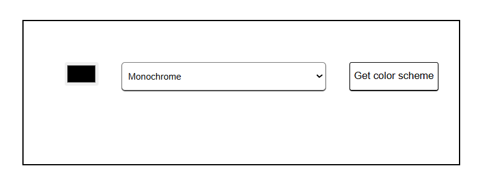
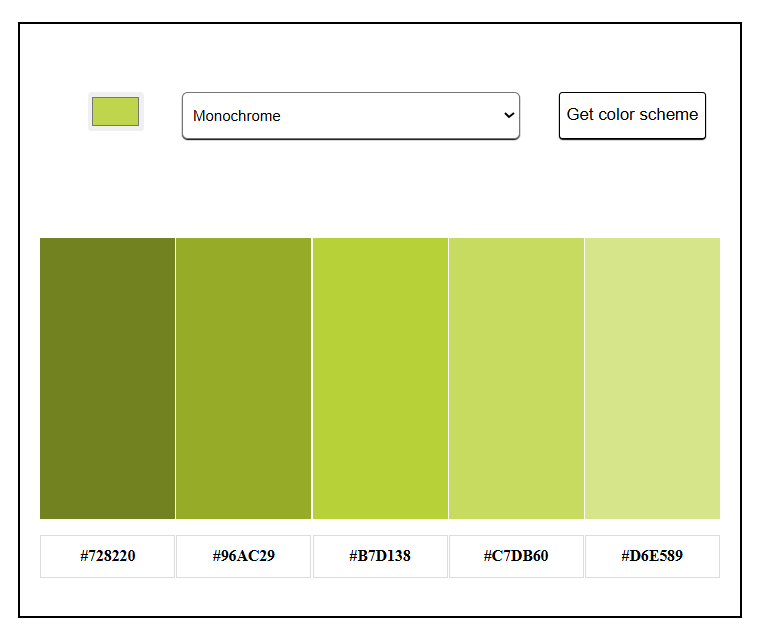

# Color Scheme Generator

A simple web app that generates color palettes based on a selected base color and scheme type using The Color API.

## Project Information

This project lets users:

- pick a base color from a color input
- choose a color scheme type from a dropdown
- generate matching colors with one click
- view the resulting palette and hex values on the page

## Tech Stack

- HTML
- CSS
- JavaScript
- The Color API

## Use Case

This project is useful for:

- designers looking for quick palette ideas
- developers building color themes for websites
- learning how to work with external APIs in JavaScript
- practicing DOM manipulation and dynamic rendering

## Features

- Color picker input
- Scheme selection dropdown
- API-based palette generation
- Live display of color blocks and hex codes

## Screenshots

### Main Interface

### Generated Palette

## How It Works

1. The user selects a base color.
2. The user chooses a color scheme type.
3. JavaScript sends a request to The Color API.
4. The response is used to display the generated palette on the page.

## Author

Created as a JavaScript project for learning and practice.
